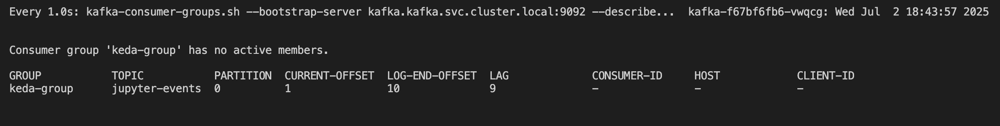

# KEDAproject

How to Run
----------
1. Clone the repository or copy the files into a working directory.

2. Run the main script:

   python main.py

3. During execution, if not connected to a Kubernetes cluster, the script will prompt you to enter the path to your kubeconfig file.

4. The script will:
   - Set up KEDA in the `keda` namespace
   - Deploy a Jupyter notebook as a Kubernetes `Deployment` + `Service`
   - Apply a KEDA `ScaledObject` (assuming `create_scaledobject()` is defined)
   - Perform a health check to ensure the deployment is active

Refer to USAGE_GUIDE.txt for more details about the project