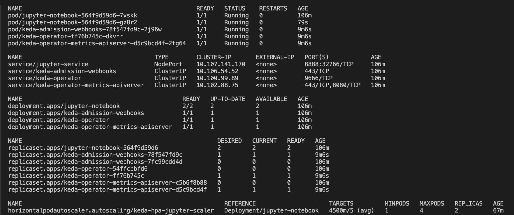
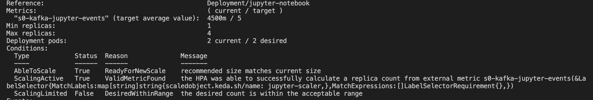

# 📊 Scale Jupyter Notebooks Dynamically with Kafka & KEDA

This project demonstrates how to **dynamically scale Kubernetes deployments** (specifically Jupyter notebooks) using **Kafka metrics** and **KEDA (Kubernetes Event-driven Autoscaler)**.

---

## 🚀 How to Run

1. **Clone the repository** or copy the scripts into your working directory.

2. **Install Python dependencies:**

   ```bash
   pip3 install pyyaml jinja2
   ```

3. **Run the main script:**

   ```bash
   python main.py
   ```

4. **During execution:**
   - If not connected to a Kubernetes cluster, you will be prompted for your `kubeconfig` file path.
   - The script performs the following tasks:
     - Sets up **KEDA** in the `keda` namespace
     - Deploys a **Jupyter notebook** as a `Deployment` and `Service`
     - Creates a **KEDA ScaledObject** to scale based on **Kafka lag**
     - Verifies the health of the deployment

---

## 📈 Example Demonstration

### ✅ Produced messages into Kafka topic without any consumer:


---

### ✅ KEDA detected Kafka lag and scaled the `jupyter-notebook` deployment:



---

### ✅ Output from `kubectl describe scaledobject` shows KEDA response:



---

## 📚 More Info

- Refer to **`USAGE_GUIDE.txt`** for complete instructions, architecture overview, and command references.
- You can find useful Kafka CLI commands in **`important_commands.txt`**.
